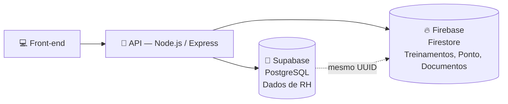

[README.md](https://github.com/user-attachments/files/32395476/README.md)
# lobios-eniac<div align="center">

# 🧭 Lobios — Plataforma de Gestão de Carreira

### Metas, avaliação de desempenho, treinamentos, plano de carreira, férias e ponto — tudo em um só lugar.

[](#)
[](#)
[](#)
[](#)
[](#)

🎓 Projeto desenvolvido como desafio da **ENIAC Academy**, para a empresa **Lobios**

[🌐 Demo ao vivo](https://lobios-eniac-iota.vercel.app) · [📋 Reportar bug](../../issues) · [✨ Sugerir feature](../../issues)

</div>

---

## 📌 Sobre o projeto

O time de RH da Lobios cuidava de tudo isso na base do improviso. A missão desse projeto é simples de falar e desafiadora de fazer: **juntar 8 processos de RH numa plataforma só**, com uma experiência diferente pra cada tipo de pessoa que faz login.

> 💡 Não são 3 telas de login — é **uma tela só**, que reconhece o perfil da pessoa e abre o conjunto de funcionalidades certo pra ela.

## 👥 Três perfis, uma plataforma

<table>
<tr>
<td width="33%" valign="top">

### 🙋 Colaborador
- Vê e edita as próprias metas
- Acompanha a própria avaliação
- Se inscreve em treinamentos
- Solicita férias
- Registra o próprio ponto

</td>
<td width="33%" valign="top">

### 👔 Gestor
- Tudo que o colaborador tem, +
- Avalia e acompanha a equipe
- Aprova/nega férias da equipe
- Vê progresso de treinamento da equipe

</td>
<td width="33%" valign="top">

### 🏢 RH
- Visão total de todos os dados
- Cadastra setores, cargos e treinamentos
- Configura critérios de avaliação
- Gerencia toda a estrutura organizacional

</td>
</tr>
</table>

## ✨ Funcionalidades

- [x] 🎯 Metas e objetivos
- [x] 📊 Avaliação de desempenho (métodos configuráveis por cargo)
- [x] 🎓 Canal de treinamentos com progresso individual
- [x] 💬 Feedback
- [x] 🪜 Plano de carreira
- [x] 🏛️ Organograma (setores, cargos e responsáveis)
- [x] 🏖️ Controle e solicitação de férias
- [x] ⏱️ Controle de ponto com anexo de documentos

## 🏗️ Arquitetura

Dois bancos de dados, cada um cuidando do que faz de melhor:



- **Supabase (PostgreSQL)** guarda os dados sensíveis de RH: usuários, cargos, setores, metas, avaliações, feedbacks, plano de carreira e férias — protegidos por Row Level Security.
- **Firebase (Firestore)** guarda conteúdo: catálogo de treinamentos, progresso individual, ponto e documentos anexados.
- A ligação entre os dois: o **mesmo UUID** identifica a pessoa nos dois bancos — sem isso, não teria como saber de quem é cada dado.

## 🧰 Stack

| Camada | Tecnologia |
|---|---|
| Banco de dados (RH) |  PostgreSQL + RLS |
| Banco de dados (conteúdo) |  NoSQL |
| API |   |
| Autenticação | Supabase Auth + Firebase Custom Token |
| Front-end |   |
| Deploy |  |

## 🚀 Como rodar localmente

```bash
# clone o repositório
git clone https://github.com/231062025/lobios-eniac.git
cd lobios-eniac

# copie o .env de exemplo e preencha com as credenciais reais
cp .env.example .env
```

> 🔑 As credenciais reais (Supabase URL/anon key, config do Firebase) são compartilhadas fora do repositório — nunca sobem pro Git.

Pra rodar a API (se estiver na mesma pasta ou num submódulo):

```bash
npm install
npm run dev
```

## 📁 Estrutura do repositório

```
lobios-eniac/
├── rh.html            # Painel do RH
├── funcionario.html   # Painel do Colaborador
├── empresa.html       # Painel do Gestor
├── style.css          # Estilos compartilhados
├── .env.example        # Variáveis de ambiente (sem valores reais)
└── README.md
```

## 🗺️ Roadmap (Sprints — metodologia ENIAC)

- [x] **Sprint 1** — Modelagem do banco de dados, TAP, 5W2H, infográfico
- [ ] **Sprint 2** — Integração da API com os dois bancos, testes gerais
- [ ] **Sprint 3** — Front-end conectado, comprovação das funcionalidades
- [ ] **Sprint 4** — Plano de implantação, apresentação final

## 👨‍👩‍👧‍👦 Time

| Papel | Responsável |
|---|---|
| 🗄️ Banco de dados | Davi |
| 🔌 API | Jackson |
| 💻 Front-end | Samuel e Tárcio |
| 📋 Proponente do desafio | Aline Lopes Ruiz — Lobios |

---

<div align="center">

Feito com 💙 por alunos do curso de **ADS** — ENIAC Academy

</div>
