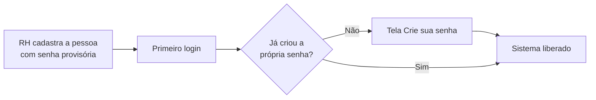
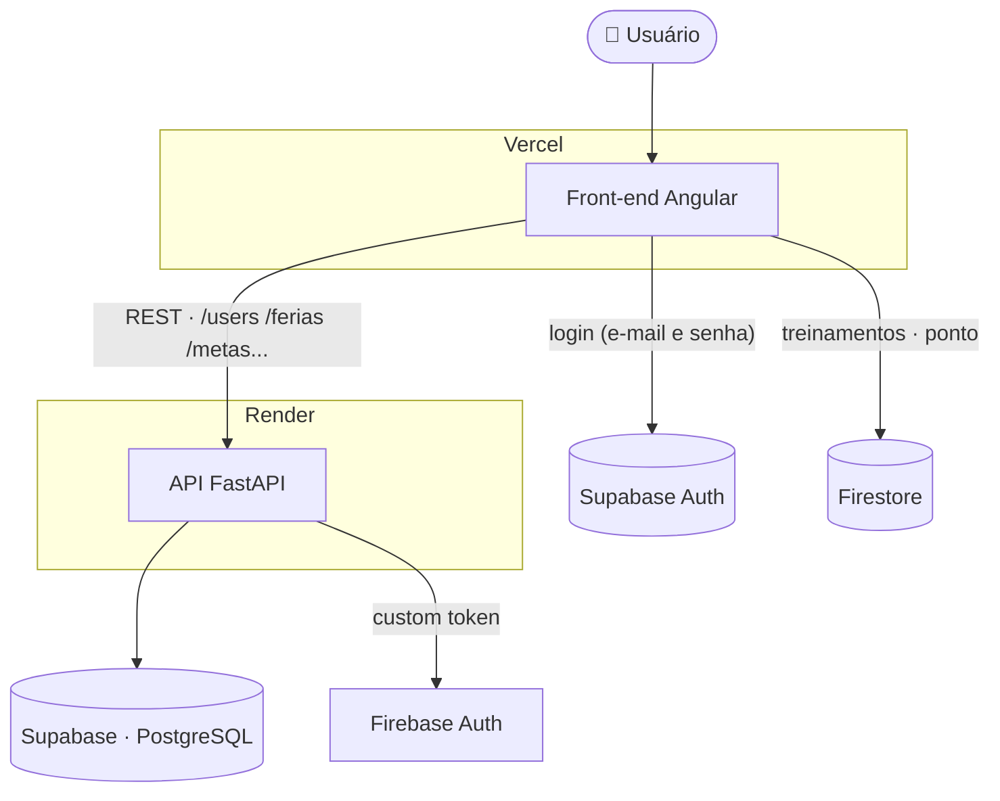
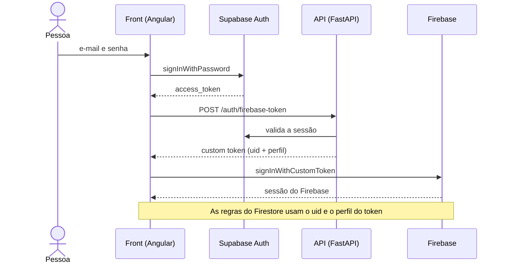

<div align="center">

# 🌐 Lobios · Plataforma de Gestão de Carreira

**Metas, desempenho, treinamentos, férias e ponto num só lugar, para colaboradores, gestores e RH.**

Desafio proposto pela **Lobios** e desenvolvido no programa de projetos do **ENIAC**.


<br>


[🚀 Acessar o sistema](https://SEU-PROJETO.vercel.app) ·
[📖 Documentação da API](https://lobios-api.onrender.com/docs) ·
[🐞 Reportar problema](https://github.com/231062025/lobios-eniac/issues)

</div>

---

## 📌 Sumário

- [Sobre o projeto](#-sobre-o-projeto)
- [Funcionalidades por perfil](#-funcionalidades-por-perfil)
- [Arquitetura](#️-arquitetura)
- [Estrutura do repositório](#-estrutura-do-repositório)
- [Como rodar localmente](#-como-rodar-localmente)
- [Deploy](#-deploy)
- [Segurança](#-segurança)
- [Como contribuir](#-como-contribuir)
- [Equipe](#-equipe)
- [Roadmap](#️-roadmap)

---

## 💡 Sobre o projeto

O RH da Lobios precisava de uma plataforma interna que reunisse tudo o que envolve a carreira de cada pessoa na empresa. Hoje essas informações ficam espalhadas em planilhas, e-mails e sistemas diferentes.

O ponto mais desafiador do pedido: **cada atividade é avaliada de um jeito**. Quem trabalha com suporte é medido por chamados resolvidos, quem desenvolve por projetos entregues, outros por horas. O Lobios permite configurar esses métodos por cargo e ainda usa as notas para **recomendar treinamentos** automaticamente.

> [!NOTE]
> Projeto acadêmico do curso de Análise e Desenvolvimento de Sistemas, organizado em sprints (TAP, 5W2H, infográfico, testes, pitch e TEP), com entregas validadas pela empresa proponente.

---

## ✨ Funcionalidades por perfil

O sistema tem **três perfis**. Cada um vê um menu diferente, e as rotas são protegidas por perfil.

<details open>
<summary><b>👤 Colaborador</b></summary>
<br>

| Tela | O que faz |
|---|---|
| **Painel** | Resumo de metas, próximas férias, último feedback e plano de carreira |
| **Minhas metas** | Acompanha as metas definidas pelo gestor e atualiza o status |
| **Férias** | Solicita períodos, vê saldo estimado e recebe lembrete quando as férias se aproximam |
| **Avaliações e feedbacks** | Notas por método de avaliação e feedbacks recebidos |
| **Plano de carreira** | Próximo cargo, previsão, requisitos e critérios de avaliação do cargo |
| **Treinamentos** | Cursos recomendados pelas notas, matrícula e progresso com barra deslizante |
| **Registro de ponto** | Entrada, saída e justificativa com documento anexado |
| **Meus dados** | Edita nome e e-mail e troca a senha |

</details>

<details>
<summary><b>🧭 Gestor</b></summary>
<br>

| Tela | O que faz |
|---|---|
| **Equipe e desempenho** | Notas da equipe filtradas por método (horas, chamados, projetos, competências) |
| **Aprovações de férias** | Aprova ou nega pedidos, com alerta quando dois períodos coincidem |
| **Avaliações** | Registra avaliações e vê os critérios cadastrados pelo RH |
| **Feedbacks** | Envia elogios e pontos de melhoria |
| **Metas da equipe** | Cria metas com prazo e destaca as vencidas |
| **Organograma** | Setores, responsáveis, cargos e pessoas |

</details>

<details>
<summary><b>🏢 RH</b></summary>
<br>

| Tela | O que faz |
|---|---|
| **Setores e cargos** | Monta a estrutura da empresa |
| **Colaboradores** | Cadastra pessoas e define perfil, setor, cargo e gestor |
| **Critérios de avaliação** | Define como cada cargo é avaliado (método e peso) |
| **Planos de carreira** | Próximo cargo, previsão e requisitos de cada pessoa |
| **Férias da empresa** | Visão geral, quem está de férias hoje e alertas |
| **Matriz de treinamentos** | Catálogo de cursos e regras de recomendação |

</details>

### 🔐 Primeiro acesso


```mermaid
flowchart LR
    A[RH cadastra a pessoa<br>com senha provisória] --> B[Primeiro login]
    B --> C{Já criou a<br>própria senha?}
    C -- Não --> D[Tela Crie sua senha]
    D --> E[Sistema liberado]
    C -- Sim --> E
```

---

## 🏗️ Arquitetura

O Lobios usa **dois bancos**, cada um para o tipo de dado em que é melhor:

- **Supabase (PostgreSQL)** guarda os dados relacionais: usuários, setores, cargos, metas, férias, avaliações, feedbacks, planos de carreira e critérios.
- **Firebase (Firestore)** guarda o conteúdo mais flexível: treinamentos, progresso, ponto e metadados de documentos.


```mermaid
flowchart TB
    U([👤 Usuário]) --> F

    subgraph Vercel
        F[Front-end Angular]
    end

    subgraph Render
        A[API FastAPI]
    end

    F -- "login (e-mail e senha)" --> SA[(Supabase Auth)]
    F -- "REST · /users /ferias /metas..." --> A
    A --> DB[(Supabase · PostgreSQL)]
    A -- "custom token" --> FA[Firebase Auth]
    F -- "treinamentos · ponto" --> FS[(Firestore)]
```

### 🔄 Como o login conecta os dois bancos

A mesma pessoa tem **o mesmo ID** no Supabase e no Firebase. A API faz a ponte:


```mermaid
sequenceDiagram
    actor P as Pessoa
    participant F as Front (Angular)
    participant S as Supabase Auth
    participant A as API (FastAPI)
    participant FB as Firebase

    P->>F: e-mail e senha
    F->>S: signInWithPassword
    S-->>F: access_token
    F->>A: POST /auth/firebase-token
    A->>S: valida a sessão
    A-->>F: custom token (uid + perfil)
    F->>FB: signInWithCustomToken
    FB-->>F: sessão do Firebase
    Note over F,FB: As regras do Firestore usam o uid e o perfil do token
```

### 🧰 Tecnologias

| Camada | Tecnologia | Uso |
|---|---|---|
| Front-end | Angular 20 (standalone, signals) | Telas dos três perfis |
| API | FastAPI + SQLAlchemy + Pydantic | Regras de negócio e CRUD |
| Banco relacional | Supabase (PostgreSQL + Auth + RLS) | Dados de RH e login |
| Banco de documentos | Firebase Firestore | Treinamentos e ponto |
| Hospedagem | Vercel (front) e Render (API) | Deploy automático a partir da `main` |

---

## 📁 Estrutura do repositório

```
lobios-eniac/
├── api/                          FastAPI (publicada no Render)
│   ├── src/main/
│   │   ├── models/               tabelas (SQLAlchemy)
│   │   ├── routes/               um arquivo por recurso + auth_routes.py
│   │   ├── server/               server.py (app) e supabase_admin.py
│   │   └── validators/           schemas Pydantic
│   ├── requirements.txt
│   └── run.py
│
├── front/                        Angular (publicado na Vercel)
│   ├── src/app/
│   │   ├── core/                 API, autenticação, Firebase, guards
│   │   ├── layout/               menu lateral
│   │   ├── shared/               componentes reutilizáveis
│   │   └── pages/                login, funcionario, gestor, rh
│   ├── firestore.rules           regras de segurança do Firestore
│   └── vercel.json
│
└── README.md
```

---

## 💻 Como rodar localmente

<details>
<summary><b>🎨 Front-end (Angular)</b></summary>
<br>

**Pré-requisitos:** [Node.js](https://nodejs.org) 20.19 ou mais novo.

```bash
cd front
npm install
npx ng serve -o
```

O site abre em `http://localhost:4200`.

Configure `front/src/environments/environment.ts`:

| Campo | O que é |
|---|---|
| `apiUrl` | Endereço da API |
| `supabaseUrl` | URL do projeto no Supabase |
| `supabaseAnonKey` | Chave **anon public** do Supabase. Se ficar vazia, o sistema entra em **modo demonstração** |
| `firebase` | Configuração do app Web do Firebase |

> [!TIP]
> No **modo demonstração**, o login não pede senha: basta o e-mail de um usuário existente e a escolha do perfil. Treinamentos e ponto ficam salvos no navegador. É útil para apresentar o sistema sem depender do login real.

</details>

<details>
<summary><b>⚙️ API (FastAPI)</b></summary>
<br>

**Pré-requisitos:** Python 3.13 ou mais novo.

```bash
cd api
python -m venv .venv
.venv\Scripts\activate          # Windows
# source .venv/bin/activate     # Linux / macOS
pip install -r requirements.txt
uvicorn src.main.server.server:app --reload
```

A documentação interativa fica em `http://localhost:8000/docs`.

Variáveis de ambiente necessárias:

| Variável | Para que serve |
|---|---|
| `SUPABASE_URL` | URL do projeto no Supabase |
| `SUPABASE_SERVICE_ROLE_KEY` | Operações de administrador (criar usuários, validar sessões) |
| `FIREBASE_SERVICE_ACCOUNT` | JSON da conta de serviço do Firebase, para gerar os custom tokens |
| Conexão do banco | String de conexão do PostgreSQL usada pelo SQLAlchemy |

</details>

---

## 🚀 Deploy

Os dois serviços publicam automaticamente a cada `push` na `main`:

| Serviço | Plataforma | Branch | Root Directory |
|---|---|---|---|
| Front-end | Vercel | `main` | `front` |
| API | Render | `main` | `api` |

> [!WARNING]
> A API está no plano gratuito do Render, que desliga o serviço depois de cerca de 15 minutos sem uso. A primeira requisição depois disso pode levar até 1 minuto. O front avisa quando isso acontece.

---

## 🔒 Segurança

- **Row Level Security** no Supabase: cada perfil só acessa os dados que pode ver.
- **Regras do Firestore** baseadas no `uid` e no `perfil` do token (veja `front/firestore.rules`).
- **Senhas** ficam só no Supabase Auth: nunca passam pela API nem pelo banco de dados da aplicação.
- **Primeiro acesso obrigatório**: a senha provisória do RH precisa ser trocada antes de usar o sistema.
- **Ponto**: o colaborador só cria registros; corrigir ou apagar é exclusivo do RH.

> [!CAUTION]
> Nunca suba para o repositório a `service_role` do Supabase nem o JSON da conta de serviço do Firebase. Elas ficam só nas variáveis de ambiente do Render. A `anon key` e o `firebaseConfig` podem ficar no front, porque são públicos por natureza.

---

## 🤝 Como contribuir

A `main` é sempre a versão oficial. Para qualquer mudança:

```bash
git checkout main
git pull
git checkout -b nome-do-ajuste        # ex.: ajuste-tela-ferias
# ... faça as alterações ...
git add .
git commit -m "descreva o que mudou"
git push -u origin nome-do-ajuste
```

Depois, abra um **Pull Request** para a `main` no GitHub e apague a branch após o merge. As versões antigas do projeto estão guardadas como **tags** `arquivo/...`.

---

## 👥 Equipe

| Integrante | Papel |
|---|---|
| **Davi** | Coordenação técnica, banco de dados e infraestrutura |
| **Jackson** | API (FastAPI) |
| *Adicionar* | Front-end |
| *Adicionar* | *Adicionar* |

**Proponente:** Aline Lopes Ruiz · Gerente Administrativa · Lobios

---

## 🗺️ Roadmap

- [x] Banco relacional no Supabase com RLS e trigger de sincronização
- [x] API com CRUD completo e documentação no Swagger
- [x] Front-end Angular com os três perfis
- [x] Ponte de autenticação Supabase → Firebase
- [x] Treinamentos e ponto no Firestore
- [x] Troca de senha e primeiro acesso
- [ ] Recuperação de senha por e-mail ("Esqueci minha senha")
- [ ] Upload dos arquivos anexados ao ponto
- [ ] API devolver perfil, setor, cargo e gestor no `GET /users`
- [ ] Testes automatizados e aprovação pela GQA
- [ ] Apresentação final e pitch na Proj Week

---

<div align="center">

Feito com 💙 pela equipe Lobios · ENIAC 2026

</div>
